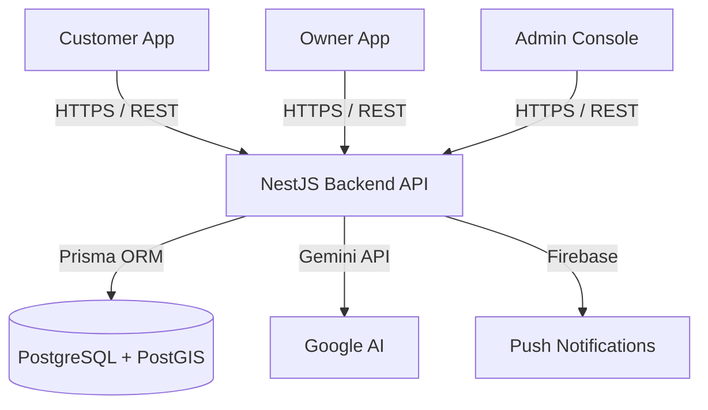

# FreshSave Architecture

FreshSave follows a unified monorepo approach containing both the mobile client and backend API, built for high scalability, geolocation efficiency, and rapid iteration.

## High-Level Data Flow

## System Components

### 1. Customer App (Flutter)
The customer-facing application is built on Flutter. 
- **Architecture**: Domain-Driven Design (DDD) layered architecture (Presentation, Domain, Data).
- **State Management**: Riverpod for reactive state management.
- **Routing**: GoRouter for deep linking and declarative routing.
- **Networking**: Dio with robust interceptors (Token refresh, Exponential backoff retry logic).
- **Role**: Discovers deals, creates reservations, tracks pickup history.

### 2. Owner App & Admin Console (Flutter)
The operations interface is built into the same Flutter application but gated by strict role-based routing (`app_router.dart`).
- **Owner Role**: Store dashboard, product/inventory management, automated AI offer generation, and QR scanning for fulfillment.
- **Admin Role**: Platform-wide store approval, audit logging, system health, and cross-tenant user management.

### 3. Backend API (NestJS)
The authoritative backend handles all business logic, security, and multi-tenancy enforcement.
- **Architecture**: Modular NestJS (AuthModule, BusinessModule, InventoryModule, OfferModule, ReservationsModule, AIModule).
- **Authorization**: Global `JwtAuthGuard` and role-based `@RolesGuard`. Multi-tenant authorization is enforced at the controller and service layer.
- **Validation**: Strict DTO validation via `class-validator`.
- **Error Handling**: Standardized HTTP exception filters.

### 4. Database (PostgreSQL)
- **ORM**: Prisma for type-safe database queries.
- **Geospatial querying**: PostGIS is leveraged for calculating raw distances between customers and stores to find "Nearby Deals."
- **Multi-Tenancy**: Every critical entity (Store, Product, Inventory, Offer, Reservation) is strictly tied to a `businessId` or `storeId` ensuring strict tenant separation.

### 5. AI Services
- **Generative AI**: Google Gemini is used to analyze inventory and auto-generate compelling deal descriptions and recommended pricing discounts.
- **Data Privacy**: Only authorized inventory data is sent to the AI service; no PII (Personally Identifiable Information) is ever shared with external LLMs.

### 6. Notifications
- **Push Services**: Abstracted notification service to handle asynchronous delivery of alerts (e.g., "Reservation Ready for Pickup", "Reservation Expired").

## Scaling Considerations
- **Stateless API**: The NestJS API is entirely stateless (JWT-based), meaning horizontal scaling can be achieved simply by adding more instances behind a load balancer.
- **Database Connection Pooling**: Prisma handles connection pooling, preventing database connection exhaustion during peak load.
